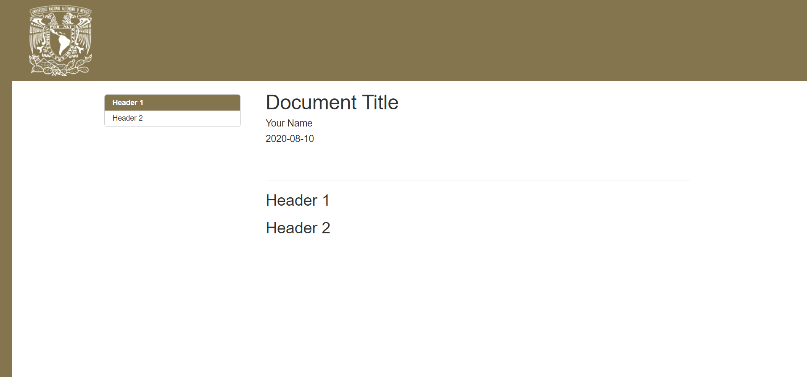
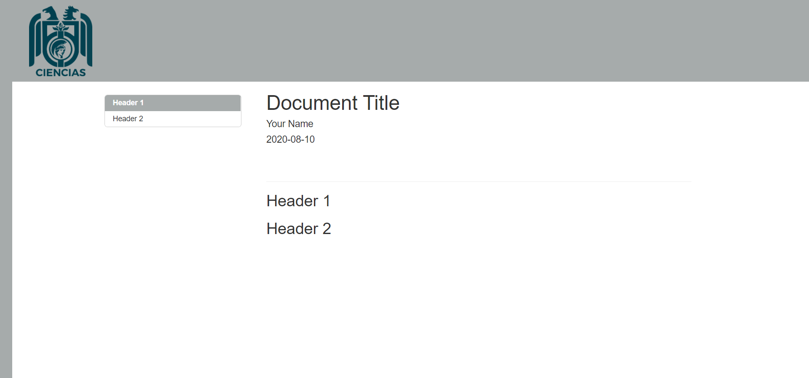

<!-- README.md is generated from README.Rmd. Please edit that file -->

# unamRmd

<!-- badges: start -->

[](https://www.tidyverse.org/lifecycle/#experimental)
<!-- badges: end -->

The goal of unamRmd is to provide templates for HTML/PDF docs and slides
to be used by UNAM community.

*Academic/Non-commercial use only*

## Installation

You can install the development version from
[GitHub](https://github.com/) with:

``` r
# install.packages("devtools")
devtools::install_github("alberto-mateos-mo/unamRmd")
```

There are currently templates using UNAM and Science Faculty logos:

#### UNAM HTML Doc



#### Facultad de Ciencias HTML DOC


